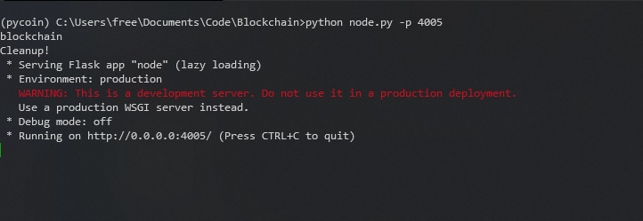

# MiCoin

Micoin is a minimalistic implementation of a decentralize blockchain system it's was created for educational purpose and is not production ready although it has all the core blockchain features like :
- proof of work
- cocensus
- block hashing
- Node peer network
- Transaction signature

In the future I'd like to make nodes websockets and store blockchain data in a  noSQL database like mongoDB.

## Usage
To get started clone this repo using ` git clone ` after that install the dependecies using `pip install -r requiment.txt`. After all the dependecies have been installed, spawn a node using `python node.py -p [port_num]` to start a node server on your localhost:port_num.

Navigate on your browser to `localhost:port_num` on the page create a wallet. your public key is what will be used for transactions you can mine to earn coin, if another node server is created navigate to the network page and add that server as a peer node so that all nodes can sync their data. node data are stored locally so next time you open start a server with the same port name click on the load wallet button to load wallet data of that port value.

## license
Usage of this project is by regulated by [MIT](LICENSE)